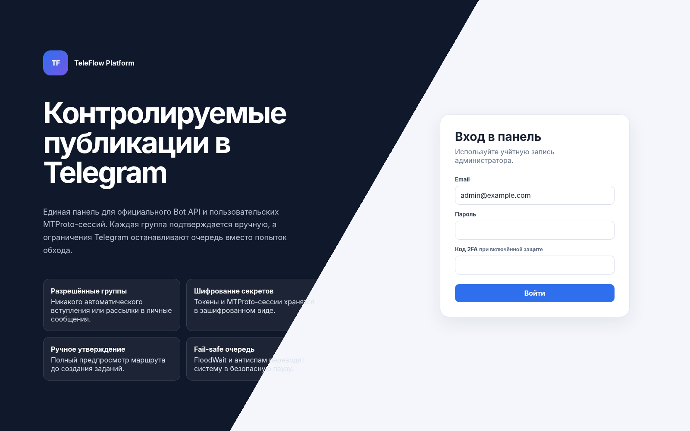
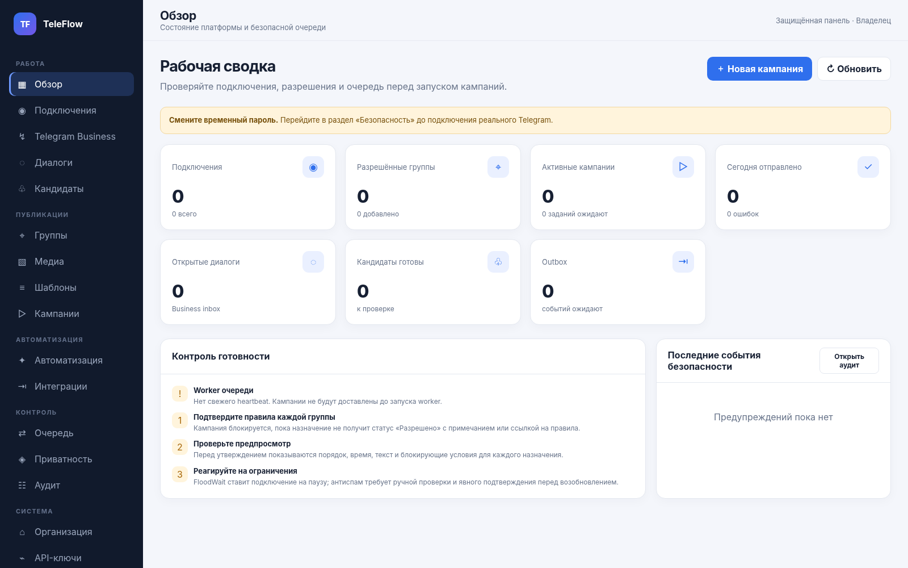
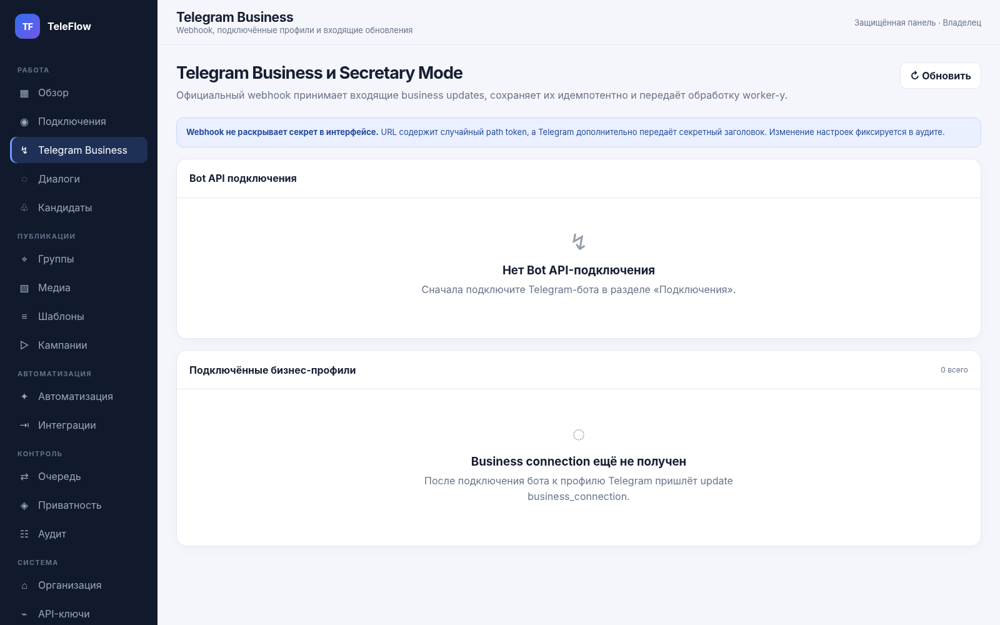
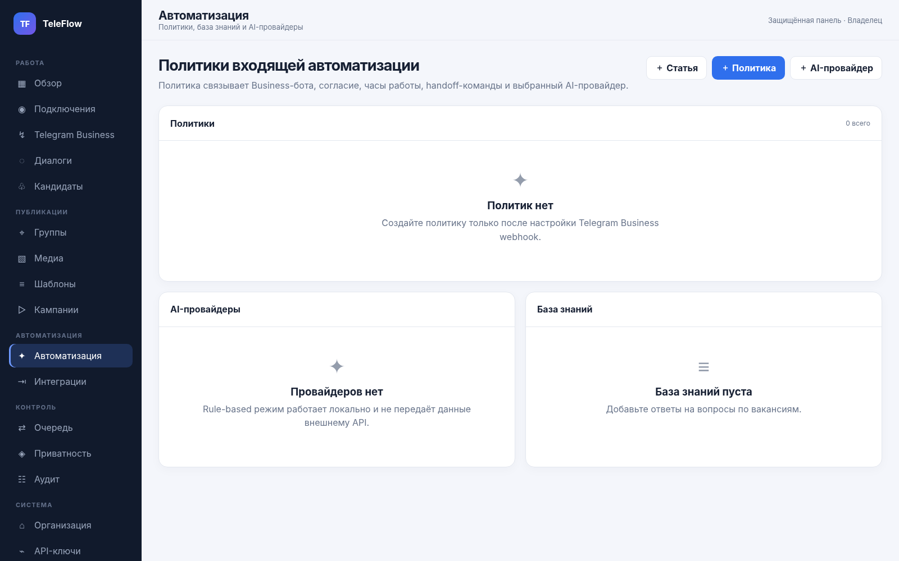
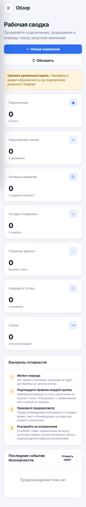

# TeleFlow Platform 2.5

## 2.5.0 — Capacity & Backpressure Assurance

Версия **2.5.0** добавляет tenant-level admission control, durable dispatch reservation, minute/hour budgets и прогноз времени обработки очереди. Проверки выполняются до создания массовых jobs, при раскрытии staged batches и непосредственно перед Telegram gateway. Подробности: [docs/CAPACITY_ASSURANCE.md](docs/CAPACITY_ASSURANCE.md).

TeleFlow Platform — self-hosted веб-система для управляемых Telegram-публикаций, обработки входящих обращений Telegram Business и квалификации кандидатов. Платформа объединяет официальный Bot API, отдельный пользовательский MTProto-аккаунт, безопасную очередь, визуальные сценарии, аналитику, AI-автоматизацию, интеграции, аудит и управление персональными данными.

> Платформа предназначена только для групп, каналов и тем, где публикация разрешена правилами или администраторами. В ней нет автоматического вступления в группы, массовых личных сообщений, ротации аккаунтов/прокси, маскировки автоматизации и обхода ограничений Telegram.

## Статус релиза

Версия **2.5.0** добавляет Capacity & Backpressure Assurance поверх Continuity Assurance 2.4:

- адаптивная русскоязычная SPA из **32 разделов** и устанавливаемый PWA-каркас;
- tenant-scoped capacity policy с ordered limits `processing ≤ ready ≤ active`;
- admission control до создания CampaignRun и DeliveryJob;
- повторная транзакционная проверка scheduler;
- ready-budget для staged rollout и ручных checkpoint;
- minute/hour network-start budgets;
- dispatch precheck до gateway и durable final reservation против гонок workers;
- immutable assessments с policy SHA-256, fingerprint и TTL;
- estimated drain time с учётом connection interval и освобождения rate-window;
- periodic worker assessments, Prometheus/Grafana и раздел «Нагрузка и лимиты»;
- production runtime требует `TELEFLOW_CAPACITY_ASSURANCE_REQUIRED=true`;
- Alembic head `bd5f7a9c3e6f` и проверяемый round-trip 2.4↔2.5;
- сохранены Continuity Assurance, Execution Fencing, Operational SLO, Release Transparency, Dependency Assurance, Change Management, Recovery Assurance, Artifact Trust, commissioning, formal pilot, Telegram Business и AI.

Подробности: [CAPACITY_ASSURANCE.md](docs/CAPACITY_ASSURANCE.md), [RELEASE_NOTES_2.5.md](docs/RELEASE_NOTES_2.5.md), [CONTINUITY_ASSURANCE.md](docs/CONTINUITY_ASSURANCE.md), [EXECUTION_FENCING.md](docs/EXECUTION_FENCING.md), [OPERATIONAL_SLO.md](docs/OPERATIONAL_SLO.md) и [ROADMAP.md](docs/ROADMAP.md).

## Интерфейс











## Возможности

### Контролируемые публикации

- последовательный pilot stage `LOCAL → SERVICE → FIVE → TWENTY → FIFTY → HUNDRED`;
- единичная фиксированная canary в собственной разрешённой служебной группе;
- сохраняемая оценка перехода с TTL и повторной проверкой fingerprint;
- live evidence предыдущего масштаба; fake-отправки не учитываются;
- диагностический support bundle без credentials, PII и текстов сообщений;
- единый gateway-контракт для Bot API и пользовательского MTProto;
- группы, супергруппы, каналы и forum topics;
- обязательное подтверждение разрешения для каждого назначения;
- безопасный импорт TXT/CSV/TSV с построчным preview;
- экспорт назначений в CSV;
- обнаружение только тех Telegram-диалогов, к которым подключение уже имеет доступ;
- отсутствие auto-join и автоматического подтверждения разрешений;
- индивидуальные IANA timezone, дни недели, временные окна, cooldown и срок действия разрешения;
- повторная Telegram-валидация назначения с `validated_at`, expiry и immutable history;
- пакетная проверка до 50 назначений с остановкой остатка после `retry_after`;
- отдельная классификация `write_forbidden` с отключением назначения;
- Production Pilot readiness перед ручным и автоматическим запуском;
- операционный календарь: one-time и weekly blackout на уровне организации/подключения/назначения;
- сохраняемый preflight с blockers/warnings по каждой группе;
- отдельный content fingerprint и защита от недавней идентичной публикации;
- staged batches: первый пакет `pending`, последующие физически `held`;
- ручной checkpoint, автоматический переход при допустимом результате и controlled abort;
- reconciliation `confirmed_sent / confirmed_not_sent / skipped` при неопределённом сетевом результате;
- текст, HTML/Markdown, изображения и документы;
- опциональная потоковая проверка медиа через ClamAV;
- шаблоны с ревизиями;
- кампании `once`, `daily`, `weekly`;
- редактирование черновиков и пауз, копирование в независимый черновик;
- стабильное A/B-распределение двух шаблонов по `(campaign, destination)`;
- полный preview маршрута и выбранного варианта до утверждения;
- отдельный запрос утверждения с прогрессом решений, сроком действия и историей;
- опциональное разделение автора запроса и утверждающего;
- два и более независимых решения для маршрута выше настраиваемого порога;
- автоматическое аннулирование разрешения при изменении текста, маршрута, расписания или правил группы;
- аварийная остановка всей организации с переводом ожидающих jobs в `waiting_review`;
- pause/resume/cancel, ручной retry и журнал доставки;
- durable jobs, lease recovery и идемпотентные запуски;
- minimum interval и дневные caps;
- отдельная обработка SlowMode, FloodWait, anti-spam, auth/write errors;
- `waiting_review` при неоднозначном сетевом результате;
- обычный retry недоступен, пока оператор не сверит фактическое наличие сообщения в Telegram.

A/B-аналитика показывает качество **доставки** каждого варианта. Она не выдаётся за конверсию кандидатов, пока внешний CRM или атрибуция не передаст соответствующее событие.

### Telegram Business и кандидаты

- установка, проверка и удаление webhook через Bot API;
- проверка секретного path token и `X-Telegram-Bot-Api-Secret-Token`;
- шифрование сырого update и дедупликация по `update_id`;
- асинхронная обработка Business updates;
- диалоги, сообщения, назначение оператора и ручной ответ;
- consent notice, stop words, handoff keywords и дневной лимит автоответов;
- визуальный линейный flow builder: сообщение, вопрос, выбор, передача оператору и завершение;
- drag-and-drop и кнопки порядка для мобильной/клавиатурной доступности;
- версии сценария: активная ревизия становится неизменяемой;
- карточка кандидата: имя, город, возраст, опыт, график, вакансия и summary;
- phone/email шифруются отдельно и раскрываются только через разрешённый endpoint;
- CSV-выгрузка кандидатов.

### AI и база знаний

- детерминированный `rule_based` provider без внешней сети;
- OpenAI-compatible provider с allowlist моделей и строгим JSON-контрактом;
- system prompt, база знаний, vacancy tags и ограниченная история текущего диалога;
- ограничение контекста, длины и частоты запросов;
- обнаружение prompt injection и redacted previews;
- отсутствие автоматического решения о найме;
- human handoff и fallback при ошибке провайдера.

### Аналитика

- диапазон дат и часовой пояс организации;
- статусы delivery jobs и success rate;
- дневной timeseries;
- открытые диалоги, handoff и consent;
- входящие сообщения;
- созданные и готовые к проверке кандидаты;
- AI success rate и средняя latency;
- outbox delivery;
- воронка обработки кандидата;
- кампании и A/B-разбивка по шаблонам;
- обезличенный CSV без текста переписки и контактов.

### Интеграции и privacy

- подписанные HMAC webhook events;
- Google Sheets через service account;
- неизменяемый CSV-object на каждое outbox-событие;
- индивидуальный статус доставки для каждого endpoint;
- retry без повторного вызова уже успешных получателей;
- API keys со scopes, сроком действия и отзывом;
- privacy export/delete по conversation/chat/user;
- зашифрованные временные exports;
- retention очистка сообщений, raw updates и просроченных файлов.

### Безопасность панели

- Argon2id;
- короткий access JWT и rotating refresh token;
- replay detection;
- HttpOnly/Secure/SameSite cookies и CSRF double-submit;
- TOTP и lockout;
- RBAC и tenant isolation;
- AES-256-GCM с field-specific AAD;
- список активных browser sessions;
- точечный отзыв устройства и завершение всех остальных сессий;
- CSP, TrustedHost, IP allowlist и безопасная обработка proxy headers;
- PWA service worker никогда не кэширует `/api`, webhook, metrics и динамические ответы;
- критические события доставки формируют дедуплицированные уведомления;
- audit log связан последовательной SHA-256 chain и проверяется из панели/CLI;
- master key можно предварительно проверить и ротировать без вывода plaintext secrets;
- Ed25519-подписи подтверждают происхождение переносимых архивов и актов;
- production принимает только артефакты от активного явно доверенного signer;
- revoke уничтожает локальную приватную часть и сохраняет публичный fingerprint для исторической проверки.

### Capacity & Backpressure Assurance

- tenant-scoped policy для active/ready/processing jobs, runs и размера одного запуска;
- admission control до создания очереди и повторная проверка внутри scheduler-транзакции;
- staged batches остаются `held`, если следующий пакет переполнит ready budget;
- minute/hour budgets считаются по фактическим `network_started` и durable `prepared` reservations;
- Safety Engine блокирует точную границу лимита до создания Telegram gateway;
- финальная reservation ловит гонку workers после предварительной проверки;
- immutable assessments сохраняют blockers, warnings, projected counts и estimated drain time;
- worker создаёт периодические assessments;
- production требует обязательный capacity gate.

### Continuity Drills & Failback Assurance

- simulation без Telegram gateway, failover request и изменения execution lease;
- live-drill `Primary → Standby → Primary` через тот же fenced production workflow;
- независимая приёмка и запрет self-signoff;
- policy fingerprint, RTO и срок действия evidence;
- runtime evidence версии, миграции и критической конфигурации;
- hash-linked event history и semantic evidence verification;
- фоновая синхронизация с savepoint isolation;
- commissioning gate, метрики, alerts и отдельный раздел «Непрерывность».

### Execution Fencing & Failover Assurance

- один active execution site на организацию и любое количество standby sites;
- монотонный fencing epoch при takeover, failover и ручной сверке;
- worker lease с TTL, active site key и владельцем процесса;
- scheduler не создаёт runs/jobs на standby-площадке;
- Safety Engine повторяет проверку epoch непосредственно перед Telegram network call;
- строка tenant lease блокируется транзакцией на время удалённого вызова;
- отдельный immutable-подобный ledger каждой сетевой попытки;
- durable `prepared` до сети и `network_started` непосредственно перед вызовом;
- падение после начала сети создаёт `WORKER_CRASH_DURING_SEND` без auto-retry;
- ручная сверка `confirmed_sent / confirmed_not_sent / skipped`;
- независимый двухэтапный failover с точной подтверждающей фразой;
- failover запрещён при processing jobs и нерешённых неопределённых доставках;
- Prometheus alerts и отдельный раздел «Active / Standby».

Для межхостового fencing требуется общая production PostgreSQL. SQLite поддерживается только для одиночного локального запуска и тестов.

### Operational SLO & Incident Assurance

- policy per organization: delivery target, error budget thresholds, queue/worker/review limits and TTL;
- immutable manual/worker assessments with policy SHA-256 and evidence fingerprint;
- gates repeated in run-now/resume, scheduler, change verification and pre-network Safety Engine;
- incident lifecycle `open → acknowledged → mitigating → resolved → closed`;
- stable dedup keys for automatic SLO incidents;
- full incident timeline, audit-chain and operator notifications;
- production startup rejects disabled mandatory SLO gates;
- Prometheus/Grafana/alerts expose SLO status, error budget and critical incidents.

### Recovery Assurance

- отдельная политика RPO/RTO для каждой организации;
- backup receipt сначала регистрируется, но не считается восстановимым до проверки архива;
- RPO учитывает только `verified` backup;
- backup database/local storage, подписанный manifest и отдельный signed receipt;
- age encryption с публичным recipient на backup host и private identity вне сервера;
- isolated SQLite restore drill и PostgreSQL metadata check;
- подписанный drill receipt, фактическая длительность и RTO result;
- import в веб-панель только JSON evidence, без raw backup и private age identity;
- commissioning block в production при просроченном backup/drill;
- safe shell wrappers не выполняют destructive restore.

## Архитектура

```text
Browser / installed PWA shell
    │ cookies + CSRF / API key
    ▼
FastAPI ── PostgreSQL ── Local/S3 storage
    │            │               │
    │            │               └─ optional ClamAV pre-storage scan
    │            ├─ campaigns / immutable delivery jobs
    │            ├─ inbound Telegram updates / conversations
    │            ├─ candidate flows / AI interactions
    │            ├─ approval requests / decisions / fingerprints
    │            └─ integration outbox / audit hash-chain / notifications / analytics
    │
    ├─ Bot API / Telegram Business
    ├─ MTProto / Telethon
    ├─ OpenAI-compatible AI
    └─ HMAC webhook / Google Sheets / CSV

Worker
    ├─ approval expiry / organization emergency stop
    ├─ scheduler
    ├─ delivery queue
    ├─ inbound queue
    ├─ integration outbox
    └─ retention/privacy jobs

Redis: singleton locks
Prometheus/Grafana/Sentry/OTel: observability
```

Подробности: [ARCHITECTURE.md](docs/ARCHITECTURE.md).

## Быстрый локальный запуск без внешнего Telegram

Требования: Python 3.12+. Node.js нужен только для JavaScript syntax-check. SQLite достаточно для development.

```bash
python -m venv .venv
```

Windows PowerShell:

```powershell
.venv\Scripts\Activate.ps1
pip install -r requirements-dev.txt
Copy-Item .env.example .env
python scripts\generate_secrets.py
```

Linux/macOS:

```bash
source .venv/bin/activate
pip install -r requirements-dev.txt
cp .env.example .env
python scripts/generate_secrets.py
```

Перенесите сгенерированные значения в `.env`, затем:

```bash
alembic upgrade head
uvicorn app.main:app --reload --port 8080
```

Во втором терминале:

```bash
python -m app.worker
```

Панель: `http://localhost:8080`.

Локальные bootstrap-данные из `.env.example`:

```text
Email: admin@example.com
Пароль: ChangeMe_123456!
```

После первого входа смените пароль. Production-профиль откажется запускаться с тестовыми секретами, SQLite, HTTP, fake mode или отключённым обязательным TOTP для администраторов.

## Первый end-to-end в fake mode

1. Откройте «Подключения» и добавьте fake bot token длиной не менее 20 символов.
2. Добавьте группу и заполните основание разрешения.
3. Создайте шаблон.
4. Создайте once-кампанию в режиме staged, например пакетами по пять назначений.
5. Проверьте preview и выполните сохраняемый preflight.
6. Отправьте кампанию на утверждение.
7. Владелец/администратор принимает решение; при включённом «четырёх глазах» это другой пользователь.
8. Для высокорискового маршрута соберите заданное число независимых решений.
9. Нажмите «Запустить сейчас»: scheduler выполнит ещё один свежий preflight.
10. Выполните `python -m app.worker --once`.
11. Проверьте первый пакет и подтвердите checkpoint перед раскрытием следующего.
12. В очереди появится статус `sent` и `fake-*` message ID; остальные пакеты до checkpoint имеют статус `held`.

## Обновление с 2.4.0 до 2.5.0

1. Остановите scheduler/worker на обеих площадках.
2. Создайте и проверьте резервную копию.
3. Обновите код и зависимости до 2.5.0.
4. Выполните `alembic upgrade head`; ожидаемый head — `bd5f7a9c3e6f`.
5. Задайте continuity-параметры и запустите обе площадки.
6. Сначала выполните simulation, затем controlled live-drill в служебной среде.
7. Проверьте `GET /api/v1/continuity/overview`, commissioning и Prometheus alerts.

## Обновление с 2.2.0 до 2.3.0

1. Остановите scheduler/worker на обеих площадках и сделайте проверенный backup.
2. Убедитесь, что нет jobs `processing`, `network_started` и нерешённых `waiting_review`.
3. Обновите код и зависимости до 2.3.0.
4. Выполните `alembic upgrade head`; ожидаемый head — `9b3d5f7a1c4e`.
5. Задайте уникальный `TELEFLOW_EXECUTION_SITE_KEY` на каждой площадке.
6. Запустите active worker, затем standby worker и проверьте heartbeat в разделе «Active / Standby».
7. Выполните canary только на active site; standby не должен создавать delivery jobs.
8. Проверьте controlled failover в служебной группе до production-трафика.

Полная процедура: [DEPLOYMENT.md](docs/DEPLOYMENT.md) и [EXECUTION_FENCING.md](docs/EXECUTION_FENCING.md).

## Обновление с 2.1.0 до 2.2.0

1. Создайте и проверьте подписанную резервную копию версии 2.1.
2. Остановите API и worker либо включите утверждённый maintenance mode.
3. Обновите код и Python dependencies до 2.2.0.
4. Выполните `alembic upgrade head`; ожидаемый head — `8a2c4e6f0b3d`.
5. Добавьте SLO-параметры в production environment и установите `TELEFLOW_SLO_GATE_REQUIRED=true`.
6. Запустите worker, дождитесь свежего heartbeat и создайте первую SLO-оценку.
7. Разрешите blockers; затем выполните commissioning, pre-change/post-change verification и staged smoke.

Downgrade schema до 2.1 использует `alembic downgrade 7f1b3d5e9a2c`. Перед downgrade экспортируйте историю SLO/инцидентов, если она нужна для расследований.

## Обновление с 1.8.0 до 1.9.0

1. Создайте и проверьте backup по Recovery Assurance 1.8.
2. Остановите API/worker либо включите maintenance mode после установки 1.9 application code.
3. Установите зависимости версии 1.9.0.
4. Выполните `alembic upgrade head`.
5. Убедитесь, что head равен `5d9f1b3c7e2a`.
6. Запустите `python scripts/doctor.py` и change/deployment verification.
7. После post-change проверки отключите maintenance mode.

Начиная с 1.9 все последующие production-изменения рекомендуется проводить через раздел «Изменения» с независимым approval и rollback plan.

## Обновление с 1.7.0 до 1.8.0

1. Включите emergency stop и остановите API/worker.
2. Создайте существующую проверенную копию БД и storage; сохраните master key, age identity и signing fingerprints отдельно.
3. Разместите код 1.8.0 и установите зависимости.
4. Добавьте recovery-переменные из `.env.example`.
5. В production настройте trusted default Ed25519 key и публичный `age` recipient.
6. Выполните migration, schema check, doctor и audit-chain verify.
7. Запустите API, не снимая emergency stop.
8. Создайте backup 1.8, выполните verify и изолированный restore drill.
9. Проверьте раздел «Восстановление» и commissioning `recovery_assurance`.
10. Только после успешной проверки запустите worker и продолжите pilot.

```bash
alembic upgrade head
alembic check
python scripts/doctor.py --json
python scripts/audit_chain.py verify --include-system --json
python scripts/recovery_backup.py --organization default --actor-email owner@example.com --output-dir /secure/backups --json
python scripts/recovery_verify.py artifact.zip.age artifact.zip.age.receipt.json \
  --organization default --actor-email owner@example.com \
  --age-identity-file /secure/age/identity.txt --json
python scripts/recovery_restore_drill.py artifact.zip.age artifact.zip.age.receipt.json \
  --organization default --actor-email owner@example.com \
  --age-identity-file /secure/age/identity.txt --json
```

Новый migration head:

```text
4c8e0a2b6d1f
```

Для production обязательно:

```env
TELEFLOW_ARTIFACT_SIGNATURE_POLICY=require_trusted
TELEFLOW_RECOVERY_REQUIRE_ENCRYPTED_BACKUP=true
TELEFLOW_RECOVERY_REQUIRE_TRUSTED_SIGNATURE=true
TELEFLOW_RECOVERY_AGE_RECIPIENT=age1...
```

`restore.sh` в 1.8 несовместимо изменён: он выполняет только drill и больше не принимает каталог восстановления рабочей БД. Подробный порядок: [DEPLOYMENT.md](docs/DEPLOYMENT.md), [RECOVERY_ASSURANCE.md](docs/RECOVERY_ASSURANCE.md) и [BACKUP_RESTORE.md](docs/BACKUP_RESTORE.md).

### Историческое обновление с 1.6.0 до 1.7.0


1. Включите emergency stop и остановите API/worker.
2. Создайте проверяемую резервную копию БД и storage.
3. Разместите код 1.7.0 и установите зависимости.
4. Добавьте новые переменные из `.env.example`.
5. В production установите `TELEFLOW_ARTIFACT_SIGNATURE_POLICY=require_trusted`.
6. Выполните migration, schema check, doctor и audit-chain verify.
7. Запустите API, не снимая emergency stop.
8. Создайте local Ed25519 key, назначьте его default и trusted.
9. Сохраните public PEM/fingerprint отдельно и проверьте тестовый signed bundle CLI-командой.
10. Выполните commissioning; после успешной проверки запустите worker и снимите emergency stop.

```bash
alembic upgrade head
alembic check
python scripts/doctor.py --json
python scripts/audit_chain.py verify --include-system --json
python scripts/verify_artifact.py test-bundle.zip \
  --trusted-public-key teleflow-public.pem \
  --require-trusted \
  --json
```

Новый migration head:

```text
3b7d9f1a2c4e
```

Для production обязательно:

```env
TELEFLOW_ARTIFACT_SIGNATURE_POLICY=require_trusted
TELEFLOW_COMMISSIONING_TTL_MINUTES=30
TELEFLOW_PILOT_READINESS_REQUIRED=true
TELEFLOW_PILOT_STAGE_ENFORCEMENT_REQUIRED=true
```

Legacy unsigned bundle не следует импортировать через ослабление production-policy. Проверьте его в изолированной среде, выполните fail-safe import и сформируйте новый signed bundle. Подробный порядок: [DEPLOYMENT.md](docs/DEPLOYMENT.md) и [ARTIFACT_TRUST.md](docs/ARTIFACT_TRUST.md).

### Историческое обновление с 1.1.0 до 1.2.0


Перед обновлением создайте проверенную резервную копию БД и storage и остановите API/worker. Состояния БД и object storage должны обновляться без параллельных записей.

```bash
# после размещения кода 1.2.0 и установки зависимостей
alembic upgrade head
python scripts/audit_chain.py backfill --include-system --yes
python scripts/audit_chain.py verify --include-system --json
```

Затем запустите API/worker и проверьте dashboard, центр уведомлений и один fake-проход. Миграция `f4a6b8c12d34` добавляет:

- запросы и решения по утверждению кампаний;
- fingerprint актуального разрешения;
- глобальное состояние аварийной остановки;
- уведомления оператора;
- состояние последовательной audit hash-chain.

Исторические audit rows намеренно не переписываются внутри online migration. Их нужно связать отдельной offline-командой `backfill`, когда сервисы остановлены. Процедура обновления, rollback и ротации master key описана в [DEPLOYMENT.md](docs/DEPLOYMENT.md).

PWA service worker обновляет только статический shell. Динамические API-ответы, cookies, credentials и персональные данные в кэш не попадают.

## Docker Compose

```bash
cp .env.example .env
python scripts/generate_secrets.py
# заполните .env
docker compose up -d --build
```

Локальная панель: `http://localhost:8080`.

Production override:

```bash
cp deploy/.env.production.example .env
# замените все CHANGE_ME
docker compose -f docker-compose.yml -f docker-compose.prod.yml up -d --build
```

`docker-compose.prod.yml` публикует внутренний HTTP только на loopback. Внешний TLS завершается host-level Nginx по примеру `deploy/nginx/teleflow-https.example.conf`.

Наблюдаемость:

```bash
docker compose --profile observability up -d prometheus grafana
```

### ClamAV

ClamAV является опциональным внешним сервисом `clamd`. Платформа использует протокол `INSTREAM` по TCP и не запускает shell-команды над пользовательскими файлами.

```env
TELEFLOW_ANTIVIRUS_MODE=clamav
TELEFLOW_ANTIVIRUS_FAIL_CLOSED=true
TELEFLOW_CLAMAV_HOST=clamav
TELEFLOW_CLAMAV_PORT=3310
TELEFLOW_CLAMAV_TIMEOUT_SECONDS=8
```

Для production рекомендуется `FAIL_CLOSED=true`: при недоступном scanner загрузка отклоняется. `FAIL_CLOSED=false` допустим только как явно принятый временный риск и записывается в аудит.

## Подключение Telegram

### Bot API

1. Создайте бота через BotFather.
2. Добавьте его в разрешённую группу.
3. Выдайте минимально необходимые права.
4. Отключите `TELEFLOW_TELEGRAM_FAKE_MODE` вне development.
5. Добавьте token через панель и выполните health check.

### Пользовательский MTProto-аккаунт

1. Используйте отдельный рабочий аккаунт владельца.
2. Владелец самостоятельно получает `api_id` и `api_hash`.
3. Авторизация проходит в панели по номеру, коду и при необходимости cloud password.
4. Код/password уничтожаются после challenge; хранится зашифрованная StringSession.
5. Можно импортировать уже доступные диалоги, но платформа не вступает в группы автоматически.
6. Начинайте с пяти разрешённых групп и ручного утверждения каждого запуска.

### Telegram Business

1. Подключите Bot API connection.
2. В разделе «Telegram Business» установите webhook.
3. Подключите бота к бизнес-профилю Telegram и предоставьте нужные права.
4. После update `business_connection` включите automation policy.
5. Сначала используйте `rule_based` AI и тестовый личный чат.

Полная процедура: [PILOT_CHECKLIST.md](docs/PILOT_CHECKLIST.md).

## Проверка релиза

```bash
./scripts/qa_release.sh
```

Скрипт выполняет:

- Python compileall;
- JavaScript syntax-check основного UI и service worker;
- 657 тестов в 69 функциональных модулях; итоговое statement coverage 92,72% при обязательном `--fail-under=80`;
- static release-asset validation: version markers, Compose YAML, JSON, локальные ссылки и запрещённые файлы;
- `alembic upgrade head`, `alembic check`, downgrade 2.5→2.4 и повторный upgrade;
- проверку audit chain и dry-run ротации master key;
- `doctor`;
- запуск отдельного Uvicorn;
- login/CSRF/dashboard/logout smoke;
- один изолированный цикл worker;
- подписанный recovery backup → verify → isolated restore drill;
- SLO/incident gates в API, scheduler, Safety Engine, change management и commissioning;
- execution fencing, durable network-attempt ledger, controlled failover и continuity/failback gates;
- Ruff, mypy и `pip-audit` dependency gate;
- проверяемый `MANIFEST.sha256` для текущего Git-дерева;
- обязательный русскоязычный docstring/JSDoc gate для 1 590 Python- и 156 JavaScript-функций.

Дополнительно:

```bash
python scripts/doctor.py
make migration-check
```

Фактические результаты: [QA_REPORT.md](docs/QA_REPORT.md).

## Работа через GitHub

Репозиторий подготовлен к ветке `main`: CI выполняет отдельные quality, Linux release-QA,
Windows regression и Docker build jobs; CodeQL анализирует Python и JavaScript по push,
pull request и еженедельному расписанию. Все внешние GitHub Actions закреплены на полных
commit SHA, а Dependabot отслеживает Python, Docker и Actions.

Перед вкладом прочитайте [CONTRIBUTING.md](CONTRIBUTING.md). Ошибки и предложения оформляются
через issue forms, изменения — через PR template. Уязвимости нельзя публиковать в issue;
порядок приватного сообщения описан в корневом [SECURITY.md](SECURITY.md).

## Документация

- [ROADMAP.md](docs/ROADMAP.md) — реализованные этапы и внешние live-gates;
- [CONTINUITY_ASSURANCE.md](docs/CONTINUITY_ASSURANCE.md) — simulation, live failover/failback, RTO и evidence;
- [RELEASE_NOTES_2.4.md](docs/RELEASE_NOTES_2.4.md) — изменения 2.4;
- [EXECUTION_FENCING.md](docs/EXECUTION_FENCING.md) — active/standby, epoch-fencing, durable attempts и failover;
- [RELEASE_NOTES_2.3.md](docs/RELEASE_NOTES_2.3.md) — исторические изменения 2.3;
- [PILOT_CERTIFICATION.md](docs/PILOT_CERTIFICATION.md) — последовательный допуск масштаба, canary и безопасная диагностика;
- [RELEASE_NOTES_1.5.md](docs/RELEASE_NOTES_1.5.md) — изменения 1.5;
- [PRODUCTION_PILOT.md](docs/PRODUCTION_PILOT.md) — readiness, повторная проверка групп и blackout-календарь;
- [RELEASE_NOTES_1.4.md](docs/RELEASE_NOTES_1.4.md) — исторические изменения 1.4;
- [ARCHITECTURE.md](docs/ARCHITECTURE.md) — компоненты и потоки данных;
- [SECURITY.md](docs/SECURITY.md) — security design и production checklist;
- [THREAT_MODEL.md](docs/THREAT_MODEL.md) — угрозы и остаточные риски;
- [DEPLOYMENT.md](docs/DEPLOYMENT.md) — Windows, Docker, Ubuntu/systemd;
- [OPERATIONS.md](docs/OPERATIONS.md) — эксплуатация и обновления;
- [RUNBOOK.md](docs/RUNBOOK.md) — ежедневные процедуры оператора;
- [API.md](docs/API.md) — endpoints, auth и service scopes;
- [AI_AUTOMATION.md](docs/AI_AUTOMATION.md) — Business inbox, visual flows и AI;
- [INTEGRATIONS.md](docs/INTEGRATIONS.md) — webhook, Sheets, CSV и outbox;
- [DATA_PRIVACY.md](docs/DATA_PRIVACY.md) — PII, consent, export/delete;
- [BACKUP_RESTORE.md](docs/BACKUP_RESTORE.md) — резервирование;
- [INCIDENT_RESPONSE.md](docs/INCIDENT_RESPONSE.md) — действия при инцидентах;
- [ACCEPTANCE.md](docs/ACCEPTANCE.md) — критерии приёмки;
- [PILOT_CHECKLIST.md](docs/PILOT_CHECKLIST.md) — live-пилот;
- [QA_REPORT.md](docs/QA_REPORT.md) — проверенный объём;
- [RELEASE_NOTES_1.3.md](docs/RELEASE_NOTES_1.3.md) — изменения 1.3;
- [CONTROLLED_OPERATIONS.md](docs/CONTROLLED_OPERATIONS.md) — preflight, staged rollout и reconciliation;
- [RELEASE_NOTES_1.2.md](docs/RELEASE_NOTES_1.2.md) — исторические изменения 1.2;
- [RELEASE_NOTES_1.1.md](docs/RELEASE_NOTES_1.1.md) — исторические изменения 1.1;
- [REFERENCES.md](docs/REFERENCES.md) — официальные источники.

## Честные внешние границы приёмки

Репозиторий содержит adapters, fake transport и интеграционные тесты, но реальные вызовы Telegram Bot API, MTProto, Telegram Business, внешнего AI, Google Sheets, S3 и ClamAV требуют credentials и инфраструктуры владельца. Секреты намеренно не входят в исходный код или архив. До production необходимо пройти live-пилот и зафиксировать фактические Telegram message IDs, webhook update IDs, права групп и результаты backup restore drill.
